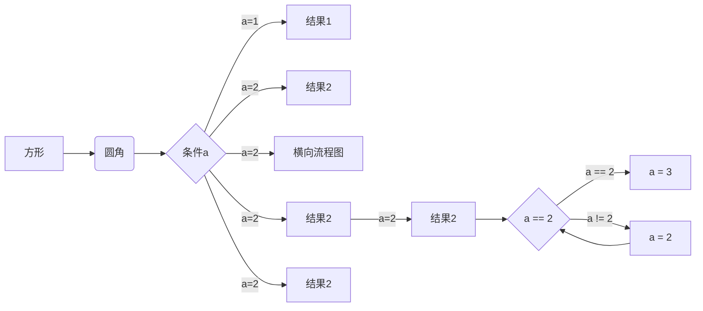

```mermaid
graph LR

A[方形] -->B(圆角)

B --> C{条件a}
C -->|a=1| D[结果1]
C -->|a=2| E[结果2]
C -->|a=2| F[结果2]
C -->|a=2| G[结果2]
G -->|a=2| I[结果2]
I --> J{a == 2}
J --> |a == 2| K[a = 3]
J --> |a != 2| L[a = 2]
L --> J
C -->|a=2| H[结果2]
F[横向流程图]


```


\```


